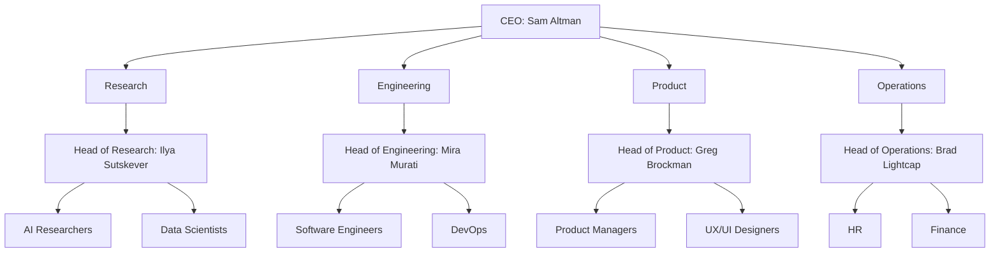

```mermaid

flowchart TD
  A[CEO: Sam Altman] --> B[Research]
  A --> C[Engineering]
  A --> D[Product]
  A --> E[Operations]

  B --> F[Head of Research: Ilya Sutskever]
  F --> G[AI Researchers]
  F --> H[Data Scientists]

  C --> I[Head of Engineering: Mira Murati]
  I --> J[Software Engineers]
  I --> K[DevOps]

  D --> L[Head of Product: Greg Brockman]
  L --> M[Product Managers]
  L --> N[UX/UI Designers]

  E --> O[Head of Operations: Brad Lightcap]
  O --> P[HR]
  O --> Q[Finance]
```

## 一些Markdown代码

这是我最近学习的项目：

- Mermaid
- Luma
- Manim
- 还有其他要学习的东西

[^都说是一个好地方]: 我没有去过，不敢妄言。

这个集中体制，我觉得挺好的。但是也未必，我觉得有点繁琐哲学了。

其实我只要学会用这个命令，生成svg就可以了。

